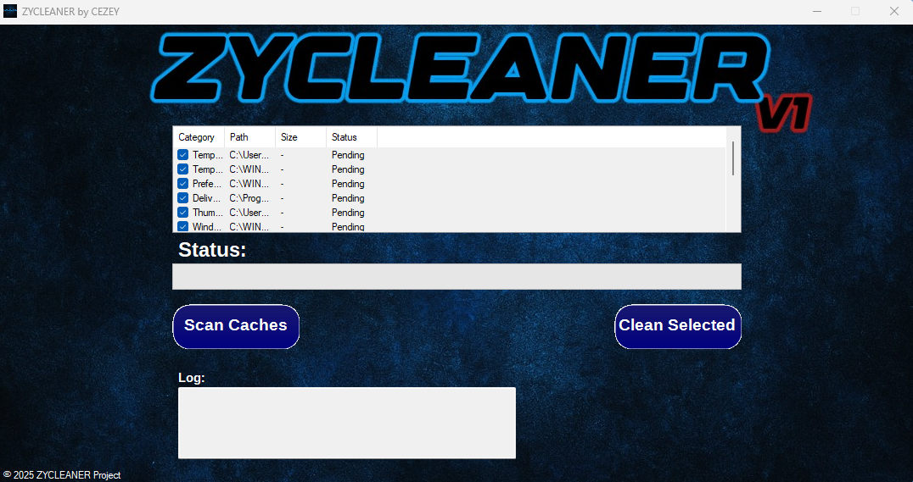

# ZYCLEANER V1

A cache cleaning app made in WinForms (C#)

<ins>Scans temporary files (or prefetch files), and deletes them (if you want)</ins>

__(Please run it as administrator as it needs UAC access to delete the files)__

## ⚙️ Features
- Scans temporary files 
- Scans prefetch files 
- Scans google chrome temp files
- User can choose what files in an respectively directory can be deleted (check marks)

